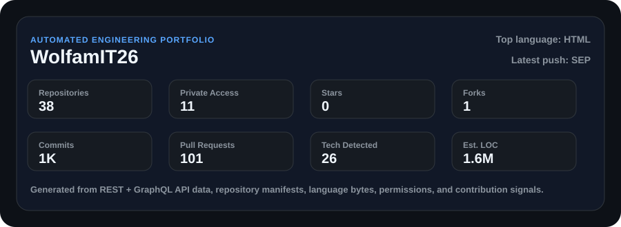
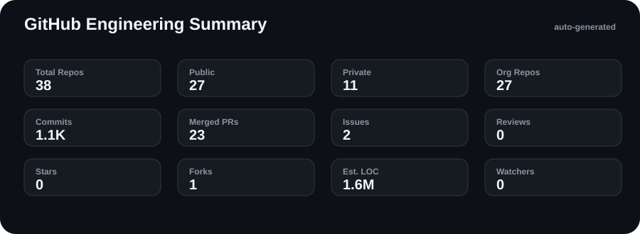
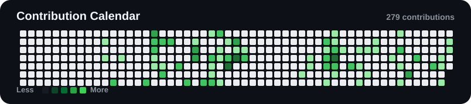
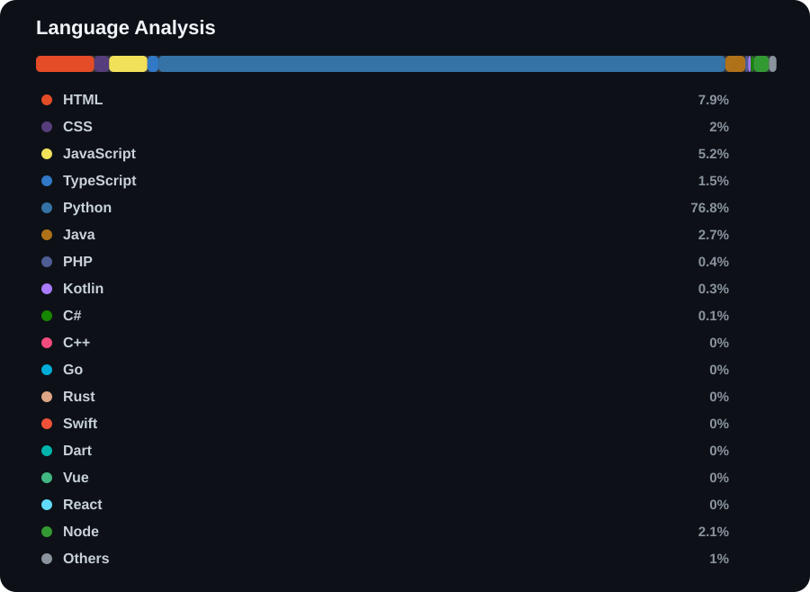
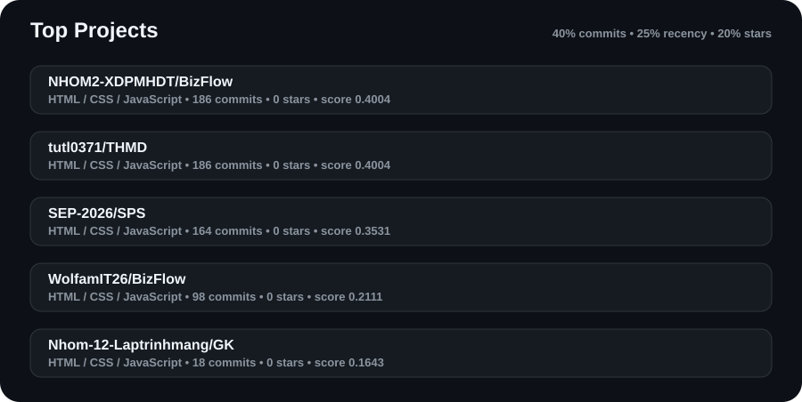
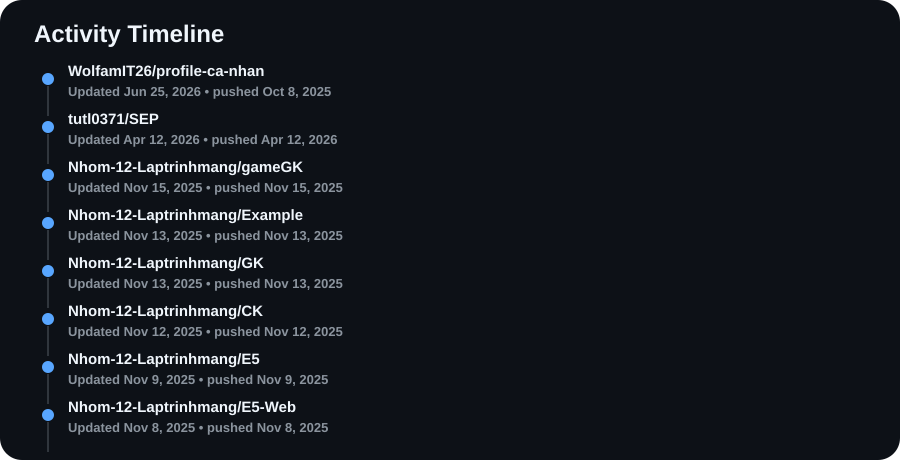
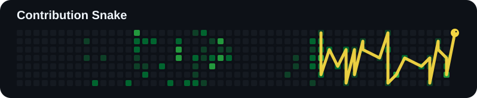

  
  <h1>Phạm Huy Đức Việt</h1>
  
<strong>@WolfamIT26</strong>

  

    
  

  
Program to succeed, connect to grow

  

    
    
    
    
    
  

## About

  

Program to succeed, connect to grow

Repository languages, topics, dependency manifests, permissions, activity, commits, pull requests, and organizations are analyzed on every run.

## Tech Stack

  

  
  
  
  
  
  
  
  
  
  
  
  
  
  
  
  
  
  
  
  
  
  
  
  
  
  
  

## GitHub Statistics

  
   
  <picture>
    <source srcset="https://streak-stats.demolab.com?user=WolfamIT26&theme=github-dark-blue&hide_border=true" media="(prefers-color-scheme: dark)" />
    
  </picture>

## Contribution Graph

  <picture>
    <source srcset="https://github-readme-activity-graph.vercel.app/graph?username=WolfamIT26&theme=github-dark&hide_border=true" media="(prefers-color-scheme: dark)" />
    
  </picture>
   
  

## Language Distribution

  

## Top Projects

### 📦 [NHOM2-XDPMHDT/BizFlow](https://github.com/NHOM2-XDPMHDT/BizFlow)

No description provided.

    
    
    
    
    
    
    
    
    
    
    
    
    
    
    

    
    
    
    
    
    
    
    

    

### 📦 [tutl0371/THMD](https://github.com/tutl0371/THMD)

No description provided.

    
    
    
    
    
    
    
    
    
    
    

    
    
    
    
    
    
    
    

    

### 📦 [SEP-2026/SPS](https://github.com/SEP-2026/SPS)

No description provided.

    
    
    
    
    
    
    
    
    
    
    
    
    
    
    

    
    
    
    
    
    
    
    

    

### 📦 [WolfamIT26/BizFlow](https://github.com/WolfamIT26/BizFlow)

No description provided.

    
    
    
    
    
    
    
    
    
    
    
    
    
    
    

    
    
    
    
    
    
    
    

    
    

### ⚙️ [Nhom-12-Laptrinhmang/GK](https://github.com/Nhom-12-Laptrinhmang/GK)

No description provided.

    
    
    
    
    
    
    
    
    
    
    
    
    

    
    
    
    
    

    

### ◇ [khuonglnd724/Nhom9_WebBanThuCung](https://github.com/khuonglnd724/Nhom9_WebBanThuCung)

No description provided.

    
    
    
    
    
    
    
    
    
    
    
    
    

    
    
    
    

    

### 📦 [ThanhVan-20/Bizflow](https://github.com/ThanhVan-20/Bizflow)

No description provided.

    
    
    
    
    
    
    
    
    
    
    

    
    
    
    
    
    
    
    

    

### ✨ [ExpenseManagement2026/MobileApp](https://github.com/ExpenseManagement2026/MobileApp)

No description provided.

    
    
    
    
    
    
    
    
    
    
    
    
    
    
    

    
    
    

    

  

## Organization Projects

### ⚙️ [tutl0371/SEP](https://github.com/tutl0371/SEP)

No description provided.

    
    
    
    
    
    
    
    
    
    
    
    

    
    
    
    

    

### ⚙️ [Nhom-12-Laptrinhmang/gameGK](https://github.com/Nhom-12-Laptrinhmang/gameGK)

No description provided.

    
    
    
    
    
    
    
    
    
    
    
    
    

    

    

### ⚙️ [Nhom-12-Laptrinhmang/Example](https://github.com/Nhom-12-Laptrinhmang/Example)

No description provided.

    
    
    
    
    
    
    
    
    
    
    
    
    

    
    

    

### ⚙️ [Nhom-12-Laptrinhmang/GK](https://github.com/Nhom-12-Laptrinhmang/GK)

No description provided.

    
    
    
    
    
    
    
    
    
    
    
    
    

    
    
    
    
    

    

### ✨ [Nhom-12-Laptrinhmang/CK](https://github.com/Nhom-12-Laptrinhmang/CK)

No description provided.

    
    
    
    
    
    
    
    
    
    
    
    

    
    

    

### ✨ [Nhom-12-Laptrinhmang/E5](https://github.com/Nhom-12-Laptrinhmang/E5)

No description provided.

    
    
    
    
    
    
    
    
    
    
    
    

    
    
    

    

### ✨ [Nhom-12-Laptrinhmang/E5-Web](https://github.com/Nhom-12-Laptrinhmang/E5-Web)

No description provided.

    
    
    
    
    
    
    
    
    
    
    
    

    
    
    
    

    

### ✨ [Nhom-12-Laptrinhmang/ELEARNING](https://github.com/Nhom-12-Laptrinhmang/ELEARNING)

No description provided.

    
    
    
    
    
    
    
    
    
    

    

    

## Latest Updated Projects

### ⚙️ [tutl0371/SEP](https://github.com/tutl0371/SEP)

No description provided.

    
    
    
    
    
    
    
    
    
    
    
    

    
    
    
    

    

### ⚙️ [Nhom-12-Laptrinhmang/gameGK](https://github.com/Nhom-12-Laptrinhmang/gameGK)

No description provided.

    
    
    
    
    
    
    
    
    
    
    
    
    

    

    

### ⚙️ [Nhom-12-Laptrinhmang/Example](https://github.com/Nhom-12-Laptrinhmang/Example)

No description provided.

    
    
    
    
    
    
    
    
    
    
    
    
    

    
    

    

### ⚙️ [Nhom-12-Laptrinhmang/GK](https://github.com/Nhom-12-Laptrinhmang/GK)

No description provided.

    
    
    
    
    
    
    
    
    
    
    
    
    

    
    
    
    
    

    

### ✨ [Nhom-12-Laptrinhmang/CK](https://github.com/Nhom-12-Laptrinhmang/CK)

No description provided.

    
    
    
    
    
    
    
    
    
    
    
    

    
    

    

### ✨ [Nhom-12-Laptrinhmang/E5](https://github.com/Nhom-12-Laptrinhmang/E5)

No description provided.

    
    
    
    
    
    
    
    
    
    
    
    

    
    
    

    

### ✨ [Nhom-12-Laptrinhmang/E5-Web](https://github.com/Nhom-12-Laptrinhmang/E5-Web)

No description provided.

    
    
    
    
    
    
    
    
    
    
    
    

    
    
    
    

    

### ✨ [WolfamIT26/profile-ca-nhan](https://github.com/WolfamIT26/profile-ca-nhan)

No description provided.

    
    
    
    
    
    
    
    
    
    
    
    

    
    
    
    
    
    
    

    
    

## Achievements

  

    
    
    
    
    
    
    
    
    
    
  

## Activity Timeline

  

## Contribution Snake

  

## Random Quote

  <blockquote><strong>Build systems that can explain themselves.</strong></blockquote>

## Contact

  

    
  

  README generated automatically from the GitHub API for <a href="https://github.com/WolfamIT26">@WolfamIT26</a>.

